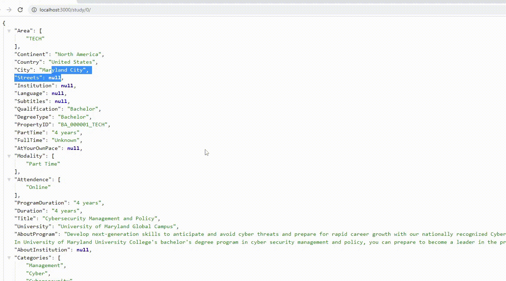

<p align="center">


</p>

<br>
</br>


<h1 align="center">Web Scraping</h1>


<p align="center">

</p>


<br>
</br>

El siguiente trabajo consiste en el desarrollo de un Pipeline de Datos para automatizar la extraccion, transoformacion y carga de datos de las siguientes paginas:

[Whed](https://whed.net/results_institutions.php)

[Study Portals](https://studyportals.com/)

Una vez finalizado se prueba una *API* en el servidor local para los contenidos obtenidos


Librerias:

<ui>
<li>
Selenium
</li>
<li>
Beautifoulsoup
</li>
<li>
Request
</li>
<li>
Json
</li>
<li>
Flask
</li>
</ui>

<br>
</br>

Ejemplo de un contenido:

```json
{
    "Area": ["TECH"],
    "Pais": "United States",
    "Ciudad": "Newark",
    "Calles": "104 Hullihen Hall",
    "Institucion": "Private",
    "Idioma": "English",
    "Subtitulos": null,
    "Calificacion": "M.Sc.",
    "Nivel": "master",
    "Part Time": "Unknown",
    "Full Time": "1 years",
    "Cursada": ["On Campus"],
    "Duracion": "Unknown",
    "Titulo": "Mechanical Engineering",
    "Universidad": "University of Delaware",
    "Descripcion Programa": "The Department of Mechanical Engineering at the University of Delaware offers graduate programs leading to the degrees of Master of Science in Mechanical Engineering (MSME) and Doctor of Philosophy (PhD) in mechanical engineering. ",
    "Descripcion Universidad": "Founded 1833.",
    "Categoria": ["Engineering","Mechanical Engineering"],
    "Deadline": null,
    "Requerimientos": null,
    "Tutition Free": "26303 EUR / year",
    "Valoracones": null,
    "Link University": "http://www.udel.edu",
    "logo": "//storage-prtl-co.imgix.net/endor/organisations/20014/logos/1607075563_bath-logo.png",
    "Multimedia": null
  }

```

API:

Code:

```python

from flask import Flask, json 

app = Flask(__name__)


'''
degree = {'Bachelor', 'Course', 'Master', 'Phd'}
page   = [0:64834]
'''

@app.route("/<degree>/<page>/")
def Study(degree, page):
    consolidado = json.load(open('Consolidado/consolidado_final.json', encoding='utf-8'))
    consolidado_page = [consolidado[i] for i in range(len(consolidado)) if consolidado[i]['DegreeType'] == str(degree)][int(page)]
    response = app.response_class(response = json.dumps(consolidado_page), status = 200, mimetype = "application/json")
    return response

app.run( port = 3000, host = "0.0.0.0" )

```

<p align="center">
  
</p>